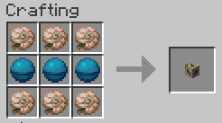

# Hardermode

---

:warning: Under development

---
Hardermode is my first Minecraft plugin.
The motivation behind it is to make the game
harder, but without making it unfair.
My point here is not have mobs killing you in a
single hit and spawning them on two blocks away
from you.

I want to keep the main gameplay just make it
more challenging, that will make the player
search for better armors and weapons. My main
goal is actually create the *midgame* aspect
that minecraft, in my opinion, lacks.

## Gameplay

Some gameplay aspects changed:

- Players can take damage 50% faster after take 
  damage.
- Any arrow with potion effect that hits a living
  entity that already has that same effect will
  have that effect amplified, capped at level V.

## Mobs

Every mob categorized as [monster](https://hub.spigotmc.org/javadocs/spigot/org/bukkit/entity/Monster.html)
will spawn with different status from Vanilla:

- 50% maximum health increased;
- 80% base damage increased;
- 50% arrow cooldown reduction;

Also, any monster that spawns with a sword, axe, bow or
crossbow, have a 25% to have an enchantment on it:

- Swords and axes may gain sharpness from I to V;
- Bows may gain power from I to V;
- Crossbows may gain piercing up to IV;

### Creeper

[Creeper](https://minecraft.fandom.com/wiki/Creeper)
explosions will destroy a shield if a
player blocks the explosion.

### Illagers

Any [Illager](https://minecraft.fandom.com/wiki/Illager)
have a 20% chance to prevent its own death by using
a [totem of undying](https://minecraft.fandom.com/wiki/Totem_of_Undying);

### Illusioner

Whenever a non-spellcaster [Illager](https://minecraft.fandom.com/wiki/Illager)
spawns, there is a 10% chance to spawn a
[Illusioner](https://minecraft.fandom.com/wiki/Illusioner)
instead.

### Skeleton

[Skeletons](https://minecraft.fandom.com/wiki/Skeleton)
(except stray and wither skeletons) have a 15% change to spawn with some
[tipped arrow](https://minecraft.fandom.com/wiki/Arrow#Tipped_arrows)
among 4:

- Arrow of Decay (which applies wither effect);
- Arrow of Harming;
- Arrow of Poison;
- Arrow of Weakness

If a skeleton spawn with any of those arrows,
he will drop it when killed.

### Stray

Stray a 10% chance to drop a [ice](https://minecraft.fandom.com/wiki/Ice).

### Husk

Husk has a 10% chance to drop a sand block.

### Elder Guardian

To make more interesting to players, Elder Guardian
now have always to drop a [trident](https://minecraft.fandom.com/wiki/Trident)
and have 30% chance to drop an [Conduit](https://minecraft.fandom.com/wiki/Conduit).
It also got buffed:

- 40% more total health;
- 20% more base damage;
- 70% more base armor;

#### Battle

While fighting an Elder guardian, you will need to take
extra care. Hitting it with a melee attack will cause
the damager to be poisoned, if the damage is caused by
a projectile, its shooter will receive the blindness effect.

On death, it will explode with the same power of a [TNT](https://minecraft.fandom.com/wiki/TNT).
  
### Piglin Brute

Now, [Piglin Brute](https://minecraft.fandom.com/wiki/Piglin_Brute)
have a 5% chance to replace a normal piglin spawn. Which
means that he can spawn anywhere on the Nether.

## Loot generation

Changes were made on loot generation.
At this point in time, only one change was
made: [Eye of Ender](https://minecraft.fandom.com/wiki/Eye_of_Ender)
can rarely spawn at most of the chests found
on any dimension.

- Eye of ender:
  - | Location      | Spawn Rate    | Amount |
    | ------------- |:-------------:| -----:|
    | Mineshaft     | 1% | 1-3 |
    | Bastion Treasure | 40% |  1-4  |
    | Bastion Bridge | 5% | 1-2 |
    | Bastion Hoglin Stable | 5% | 1-2 |
    | Buried Treasure | 2% | 1-2 |
    | End city Treasure | 10% | 1-5 |
    | Desert Pyramid | 1% | 1-2 |
    | Igloo | 5% | 1 |
    | Jungle Temple | 10% | 1-3 |
    | Nether Fortress | 30% | 1-5 |
    | Pillager Outpost | 5% | 1-2 |
    | Ruined Portal | 1% | 1-3 |
    | Shipwreck Treasure | 7% | 1-2 |
    | Shipwreck Supply | 3% | 1-3 |
    | Simple Dungeon | 1% | 1 |
    | Underwater big ruin | 8% | 1-2 |
    | Woodland Mansion | 15% | 1-5 |
  
## Recipes

Some recipes have been changed:

- Eye of Ender is no longer craftable and can
only be found by looting chests.
- Enchanted Golden Apple is now craftable with emerald
  block, nether star, golden apple and lapiz block;
  
  
- Conduit craft has changed;
  
  